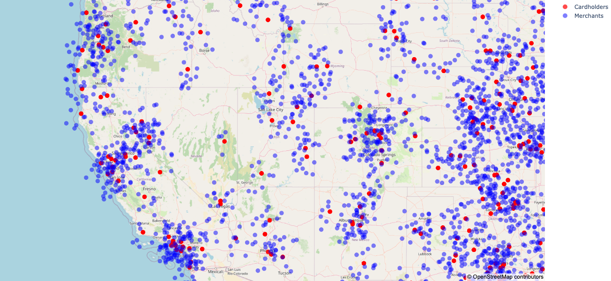
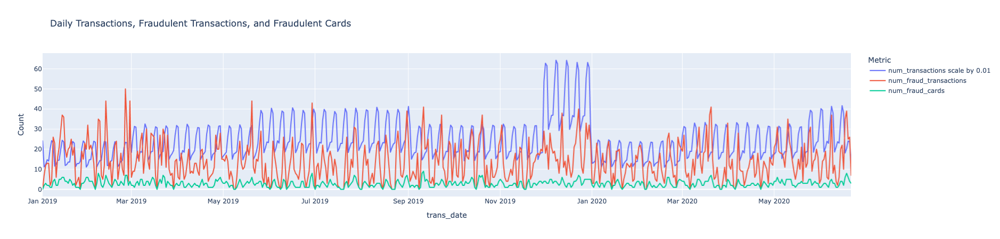
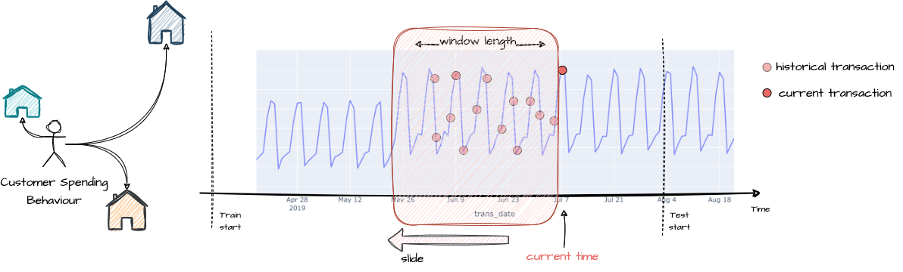
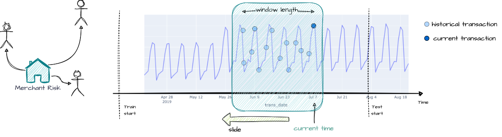
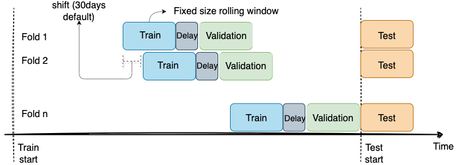
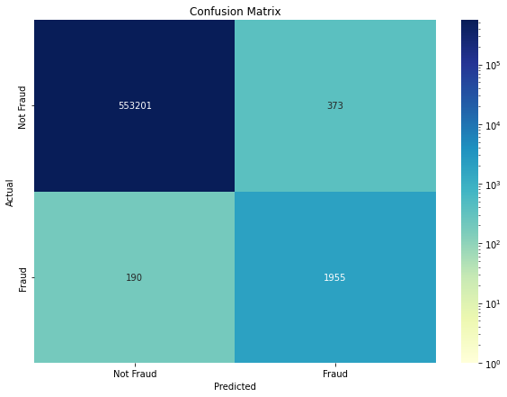

# Fraud Detection for Trade Republic

This repository contains the implementation of a fraud detection model for credit card transactions. The model is designed to identify and prevent fraudulent activities in credit card transaction operations. The issues addressed are: 
1. [Categorical Feature Encodin](#categorical-feature-encoding)

2. [Feature Engineering](#feature-engineering)

3. [Train-Val Splitting Strategy](#train-val-splitting-strategy)

4. [Evaluation Metric (Imbalance Target)](#evaluation-metric)

5. [Data Distribution Shifts](#data-distribution-shifts)

6. [Interpretability and Explainability](#interpretability-and-explainability)

<p align="center">
    
</p>

## Table of Contents

- [Introduction](#introduction)
- [Key Issues](#key-issues)
    - [Categorical Feature Encoding](#categorical-feature-encoding)
    - [Feature Engineering](#feature-engineering)
    - [Train-Val Splitting Strategy](#train-val-splitting-strategy)
    - [Evaluation Metric](#evaluation-metric)
    - [Data Distribution Shifts](#data-distribution-shifts)
    - [Interpretability and Explainability](#interpretability-and-explainability)
- [Final Results](#final-results)    
- [Outlook](#outlook)
- [Installation](#installation)
- [Usage](#usage)
- [Jupyter Notebooks](#jupyter-notebooks)
- [Code Structure](#code-structure)
- [License](#license)

## Introduction
Fraud detection is a cost-sensitive challenge. Missing a fraudulent transaction incurs significant costs, including reimbursement, potential further fraud, customer service expenses, and reputational damage. False alerts on legitimate transactions generally involve lower costs, such as verification with the customer, but can cause inconvenience due to blocked payments. The detection reaction time is crucial; shorter reaction times can prevent more frauds.

<p align="center">
    
</p>

## Key Issues
We aim to address several key issues in this project:

### Categorical Feature Encoding
The main challenges for encoding categorical features are:
1. Too many distinct values for jobs.
2. New (unseen during training) jobs or categories (merchants) are added in test data.

To address these issues, we created an initial job normalization gazetteer using Gemini 1.5 Pro to categorize the jobs into 11 categories. When encoding jobs for the test set, we use fuzzy matching for unseen values in the gazetteer to update the gazetteer. For a sanity check, change the job list to a small list of jobs unseen in the gazetteer and run:
```bash
python src/utils/create_job_normalisation.py
```

### Feature Engineering
The `generic_customer_spending_behaviour` and `general_customer_spending_behaviour` quantified customer spending behaviour in generic and general patterns. The spending patterns are calculated on a rolling window with a fixed size of 1, 7, 30, 90 and 180 days.

<p align="center">
    
</p>

The `get_merchant_risk_rolling_window` calculates a merchant's fraud risk score. The score is the average percentage of fraudulent transactions within several past time windows (defined by a list of window sizes), shifted back one week to account for fraud detection delays. The function outputs the risk score and the total number of transactions for each window size. During testing, we add the merchant risk score calculated from training set to the merchant of transaction by matching merchant name, latitute and longitute. For unseen merchant name or address, one could fill it with the average risk score anong the region(city/state). For simplicity, we fill it with 0.

<p align="center">
    
</p>

### Train-Val Splitting Strategy
To prevent data leakage and mimic real-world fraud detection, the dataset is split into training and validation sets chronologically, with validation transactions occurring after training transactions. A delay period is incorporated to simulate the time lag before fraud is detected. A rolling window approach on the time axis further enhances robustness and data usage.
<p align="center">
    
</p>

### Evaluation Metric
Due to data imbalance, evaluation metrics include F1 score, ROC AUC, average precision, top-K precision, confusion matrix, PRAUC the actual monetary losses from undetected fraud.

<p align="center">
    
</p>

### Data Distribution Shifts
This is calculated using the KL divergence and multiple data drift in amount were detected on a monthly basis.

### Interpretability and Explainability
This serves for future research. One possible way to do it is to print out the shapely value during training.

## Final Results
			
| roc_auc | average precision | f1 score | top 50 |money loss | 
|---|---|---|---|---|
| 0.955  |  0.771 |  0.877 | 0.202 | 41311.61|

<p align="left">
    
</p>

## Outlook

For further study, I plan to delve into the following areas:

- **Deep Learning**: Build my own transformer model (along with this, do ablation study, model calibration and validation...)

- **Generative Modelling**: If I were given real data, I would also try to fit the data to a generative model for future synthetic data generation, sample path simulation...

- **Explainability and Interpretability**: I would go deeper in exploring explainability and interpretability combined with domain knowledge

- **Anomaly Detection**: I would investigate advanced techniques for detecting anomalies in the data, refining methodologies to gain deeper insights on imbalanced fraud transactions.

- **Dynamic Causal Discovery**: I would conduct causal analysis on direct and early caused of a transaction being flagged using dynamic causal discovery (this still remain as higher level actiona and require demanding domain knowledge). The Markov blanket could then be leveraged for data imputation

## Installation
To install the necessary dependencies, run the following command:
1. Create your Virtual Environment
    ```bash
    conda create -n fraud_detection
    conda activate fraud_detection
    ```

2. Install requirements
    ```bash
    pip install -r requirements.txt
    ```
## Usage
To use the fraud detection system, follow these steps:
1. Clone the repository:
    ```bash
    git clone https://github.com/yourusername/Fraud-Detection-TR.git
    ```
2. Navigate to the project directory:
    ```bash
    cd Fraud-Detection-TR
    ```
3. Run the script:
    ```bash
    python create_data_testing.py
    ```

## Jupyter Notebooks
We created several notebooks to showcase the our workflow in the following order:

- [EDA](https://github.com/ichbinlan99/Fraud-Detection-TR/blob/eda/notebooks/EDA.ipynb)

- [Feature Engineering](https://github.com/ichbinlan99/Fraud-Detection-TR/blob/eda/notebooks/feature_engineering.ipynb)

- [Modelling](https://github.com/ichbinlan99/Fraud-Detection-TR/blob/eda/notebooks/Modelling.ipynb)

- [Eval](https://github.com/ichbinlan99/Fraud-Detection-TR/blob/eda/notebooks/Eval.ipynb)

- [Data Drift](https://github.com/ichbinlan99/Fraud-Detection-TR/blob/eda/notebooks/Data_drift.ipynb)

## Code Structure
The repository is structured as follows:

```
FRAUD-DETECTION-TR/
├── data/
│   ├── raw/
│   ├── processed/
├── notebooks/
│   ├── Data_drift.ipynb
│   ├── EDA.ipynb
│   ├── Eval.ipynb
│   ├── Feature_engineering.ipynb
│   ├── Modelling.ipynb
├── out/
│   ├── corr_map.png
│   ├── customer_spending_behaviour.png
│   ├── fraud_by_map.png
│   ├── merchant_risk_factor.png
│   └── ...
├── saved_model/
│   ├── classifier/
│   ├── encoders/
│   └── scaler/
├── src/
│   ├── data/
│   │   ├── __pycache__/
│   │   ├── data_splitting.py
│   │   └── data_transformation.py
│   ├── features/
│   │   ├── __pycache__/
│   │   ├── feature_engineering.py
│   │   ├── feature_selection.py
│   │   └── feature_transformation.py
│   ├── models/
│   │   ├── __pycache__/
│   │   └── tree_based.py
│   ├── utils/
│       ├── __pycache__/
│       ├── create_job_normalisation.py
│       ├── eval_metrics.py
│       ├── kill_session.py
│       └── plots.py
├── jobs_by_category.json
├── LICENSE
├── README
└── requirement.txt.
```


## License
This project is licensed under the MIT License. See the [LICENSE](LICENSE) file for details.md