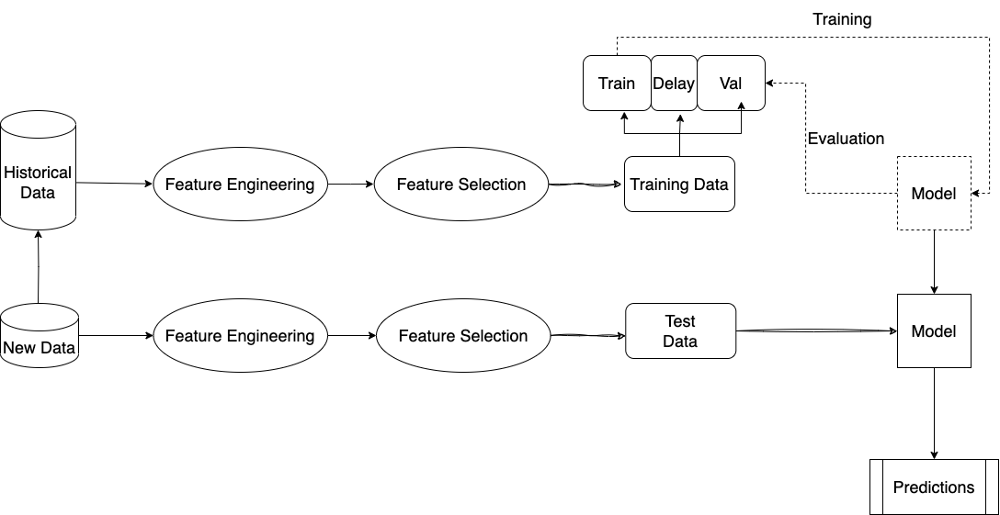
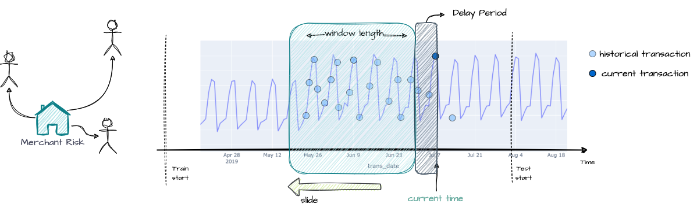
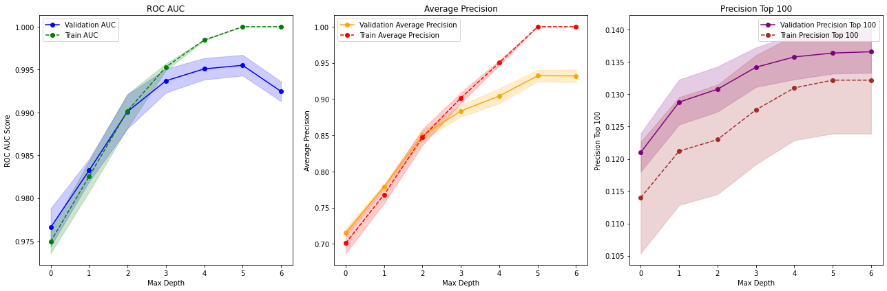

# Fraud Detection for Trade Republic

This repository contains the implementation of a fraud detection system for credit card transactions. The system is designed to identify and prevent fraudulent activities in credit card transaction operations. The issues addressed are\
1. target imbalance
2. data distribution shifts
3. interpretability and explainability

<p align="center">
    
</p>


## Table of Contents
- [Introduction](#introduction)
- [Installation](#installation)
- [Usage](#usage)
- [Code Structure](#code-structure)
- [License](#license)

## Introduction
The fraud detection system leverages machine learning algorithms to analyze transaction patterns and detect anomalies that may indicate fraudulent behavior. The goal is to enhance the security and integrity of trading operations.

<p align="center">
    
</p>


### Categorical Feature Encoding
The main challenge for encoding categorical features are:
1. too many distinct values for jobs
2. new(unseen during training) jobs or category(merchant) are added in test data

To address these issues, we created an initial job normalisation gazetteer using Gemini 1.5 pro to categorize the jobs into 12 categories. When encoding jobs for test set, we use fuzzy match for unseen values in the gazetteer to update the gazetteer. For a sanity check, change the job list to a small list of jobs unseen in gazetteer and run:
```bash
python src/utilscreate_job_normalisation.py
```

### Feature Engineering
During EDA, we saw 
<p align="center">
    
</p>

<p align="center">
    
</p>

### Train-Val Splitting

<p align="center">
    
</p>


### Evaluation Metric


<p align="center">
    
</p>

## Installation
To install the necessary dependencies, run the following command:
1. Create your Virtual Environment
    ```bash
    conda create -n fraud_detection
    conda activate fraud_detection
    ```

2. Install requirements
    ```bash
    pip install -r requirements.txt
    ```

## Usage
To use the fraud detection system, follow these steps:
1. Clone the repository:
    ```bash
    git clone https://github.com/yourusername/Fraud-Detection-TR.git
    ```
2. Navigate to the project directory:
    ```bash
    cd Fraud-Detection-TR
    ```
3. Run the main script:
    ```bash
    python main.py
    ```


## Jupyter Notebooks
We created several notebooks to showcase the models and to create figures seen in the report.

- [EDA](https://github.com/ichbinlan99/Fraud-Detection-TR/blob/eda/notebooks/eda_data_prep.ipynb)

- [Feature Engineering](https://github.com/ichbinlan99/Fraud-Detection-TR/blob/eda/notebooks/eda_data_prep.ipynb)

- [Modelling](https://github.com/ichbinlan99/Fraud-Detection-TR/blob/eda/notebooks/model.ipynb)

- [Evaluation](https://github.com/ichbinlan99/Fraud-Detection-TR/blob/eda/notebooks/evaluation.ipynb)


## Code Structure
The repository is structured as follows:
```
FRAUD-DETECTION-TR/
├── data/
│   ├── raw/
│   ├── processed/
├── notebooks/
│   ├── EDA.ipynb
│   ├── Evaluation.ipynb
│   ├── Feature_engineering.ipynb
│   ├── model.ipynb
│   ├── Models.ipynb
├── out/
│       ├── corr_map.png
│       ├── ...
├── saved_model/
│       ├── classifier/
│       ├── encoders/
│       └── scaler/
├── src/
│   ├── data/
│   │   ├── __pycache__/
│   │   ├── data_splitting.py
│   │   └── data_transformation.py
│   ├── features/
│   │   ├── __pycache__/
│   │   ├── feature_engineering.py
│   │   ├── feature_selection.py
│   │   └── feature_transformation.py
│   ├── models/
│   │   ├── __pycache__/
│   │   └── tree_based.py
│   ├── utils/
│       ├── __pycache__/
│       ├── create_job_normalisation.py
│       ├── eval_metrics.py
│       ├── kill_session.py
│       └── plots.py
├── jobs_by_category.json
├── LICENSE
└── README.md
```


## License
This project is licensed under the MIT License. See the [LICENSE](LICENSE) file for details.